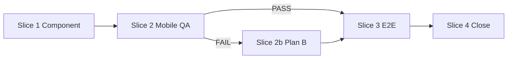

# Plan: Landscape comparison table component

**Phase:** Plan (LOOP)  
**Output version:** v1  
**Date:** 2026-05-22  
**Authority:** `.productbrain/specs/landscape-comparison-table.md` (v1)  
**Estimate:** 1 implementation slice + verification

---

## Sequence overview

```text
Slice 1 — Component + page wiring + unit test
Slice 2 — Manual mobile QA (Plan A); Plan B only if blocked
Slice 3 — E2E narrow viewport
Slice 4 — moon check + Chain INS/DEC update if needed
```

---

## Slice 1: Component extraction (Plan A)

**Owner:** Deliver  
**Write scope:**

| File | Action |
|------|--------|
| `apps/frontend/src/lib/components/marketing/LandscapeComparisonTable.svelte` | **Create** |
| `apps/frontend/src/lib/components/marketing/LandscapeComparisonTable.svelte.test.ts` | **Create** |
| `apps/frontend/src/routes/+page.svelte` | **Edit** — replace lines 532–592 with `<LandscapeComparisonTable rows={comparison} />`; remove `getRowCells` / `statusIcon` / `statusColor` if moved |

### Implementation steps

1. **Scaffold component** (`lang="ts"`, Svelte 5 runes)
   - `interface Props { rows: ComparisonRow[]; class?: string }`
   - `let { rows, class: className = '' }: Props = $props();`
   - Import `cn`, `Check`, `X`, `Minus`, `ExternalLink` from existing page imports.

2. **Column config** (private const)
   ```typescript
   const columns = [
     { key: 'svelteLanggraph', label: 'svelte-langgraph', href: null, highlight: true },
     { key: 'langflow', label: 'Langflow', href: 'https://www.langflow.org' },
     // ...
   ] as const;
   ```
   - `getRowCells(row)` returns statuses in column order.

3. **Markup — semantic table**
   - Outer: `role="region"` + `aria-label="Tool comparison"`
   - Scroll wrapper classes:
     ```text
     max-md:overflow-auto max-md:max-h-[min(70vh,32rem)]
     md:overflow-visible
     rounded-xl border
     ```
   - `<table class="min-w-[800px] w-full border-collapse">`
   - `<caption class="sr-only">...</caption>`
   - `<thead>`: corner `th`, then column `th scope="col"` with links/spans
   - `<tbody>`: `{#each rows as row, i (row.label)}` → `th scope="row"`, then `td` with icon + `aria-label`

4. **Sticky classes (mobile only via `max-md:` prefix)**
   - Corner `th`: `max-md:sticky max-md:top-0 max-md:left-0 max-md:z-30 max-md:bg-muted/30`
   - Header `th` (not corner): `max-md:sticky max-md:top-0 max-md:z-20 max-md:bg-muted/30`
   - Row `th`: `max-md:sticky max-md:left-0 max-md:z-20` + stripe bg classes matching row
   - First column shadow: `max-md:shadow-[4px_0_8px_-2px_rgba(0,0,0,0.12)]`

5. **Status helpers** (private)
   - `statusIcon`, `statusColor`, `statusAriaLabel(status, toolName)` → "Supported", "Partial", "Not supported"

6. **Wire page**
   - Import component; pass `rows={comparison}`; keep `comparison` const and `ecosystemLinks` in section footer (unchanged).

### Validation (Slice 1)

```bash
moon frontend:lint
moon frontend:typecheck
moon frontend:test -- --run LandscapeComparisonTable
```

**Unit test** (`LandscapeComparisonTable.svelte.test.ts`):

- Use `renderWithProviders` pattern from `ChatErrorMessage.svelte.test.ts` if providers needed; else `@testing-library/svelte` `render`.
- Assert `getByRole('table')` visible.
- Assert first row label text from fixture data (one row).
- Assert `getByRole('columnheader', { name: /svelte-langgraph/i })`.

---

## Slice 2: Mobile QA gate (Plan A vs Plan B)

**Owner:** Deliver + manual  
**Blocked by:** Slice 1 mergeable

### Manual checklist (375×812 or DevTools iPhone)

- [ ] Load `/` → landscape section
- [ ] Scroll table right → "Security review friendly" (or any row label) still visible
- [ ] Scroll table down → "Langflow" / "Chainlit" headers still visible
- [ ] Diagonal scroll → corner + axes still readable
- [ ] Desktop 1280px → no inner scroll trap; table matches pre-change screenshot

### If A5/A6 fail → Slice 2b (Plan B / DEC-6)

**Additional write scope:** same component file only.

1. Split DOM:
   ```text
   div.table-shell
     div.header-track (overflow-hidden)
       div.header-inner (will transform)
         table / thead only
     div.body-scroll (overflow-auto, bind:this=bodyEl, onscroll=syncHeader)
       table / tbody only
   ```
2. `function syncHeader() { headerInner.style.transform = \`translateX(-${bodyEl.scrollLeft}px)\`; }`
3. Keep column widths aligned (fixed `colgroup` or `table-fixed` + col widths).
4. Re-run manual checklist on iOS Safari + Chrome Android.

**Do not start Slice 2b without failed QA evidence** (screenshot or note in PR).

---

## Slice 3: E2E

**Owner:** Deliver  
**Write scope:** `e2e/src/homepage.spec.ts` (new)

```typescript
test('landscape table keeps row label when scrolled horizontally on mobile', async ({ page }) => {
  await page.setViewportSize({ width: 375, height: 812 });
  await page.goto('/');
  const region = page.getByRole('region', { name: 'Tool comparison' });
  await region.scrollIntoViewIfNeeded();
  const scroller = region.locator('[data-testid="landscape-table-scroll"]'); // add to component
  await scroller.evaluate((el) => { el.scrollLeft = 200; });
  await expect(region.getByRole('rowheader', { name: /Security review/i })).toBeVisible();
  // second assertion: column header after vertical scroll
});
```

Add `data-testid="landscape-table-scroll"` on scroll wrapper in component (test-only attribute OK per project patterns).

```bash
moon e2e:test -- --grep landscape
```

---

## Slice 4: Close

| Step | Command / action |
|------|------------------|
| Full frontend check | `moon check frontend` (or `moon frontend:lint` + `moon frontend:typecheck` + tests) |
| Capture learning | If Plan A sufficient: `pb capture "INS: Landscape table sticky works with max-md overflow-auto scrollport — DEC-6 split header not needed"` |
| If Plan B used | `pb capture "DEC: Landscape table requires DEC-6 split header on iOS — CSS-only sticky top insufficient"` |
| Human | Review draft captures; commit spec/plan paths in PR description |

---

## Dependency graph



---

## Workstream table

| Slice | Depends on | Validation | Status |
|-------|------------|------------|--------|
| 1 | Spec v1 | lint, typecheck, unit | pending |
| 2 | 1 | manual mobile QA | pending |
| 2b | 2 FAIL | manual iOS/Android | conditional |
| 3 | 2 or 2b | e2e grep landscape | pending |
| 4 | 3 | moon check frontend | pending |

---

## Reviewer sign-off (Plan phase)

| Reviewer | Verdict | Notes |
|----------|---------|-------|
| Chain Steward | SIGN-OFF | Plan materializes spec; DEC-6 gated correctly |
| Systems Architect | SIGN-OFF | Disjoint slices; Plan B conditional |
| Delivery Quality | SIGN-OFF | Commands and tests specified |

**Plan loop status:** PASS — ready for Deliver when user authorizes implementation.
